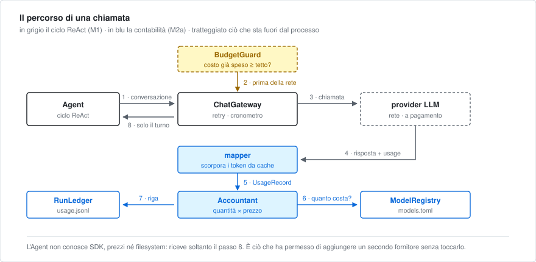

# ORC V2

[](https://github.com/Vins126/OrcV2/actions/workflows/test.yml)

Sistema multi-agente con **instradamento per costo** per task di ingegneria del
software. Progetto di tesi.

L'ipotesi che il sistema deve mettere alla prova, formulata come problema di
ottimizzazione vincolata:

```
min  Σ costo(modello_i)        soggetto a    qualità(output) ≥ τ
```

In parole: **ottenere la stessa qualità spendendo meno**, instradando ogni
sotto-task al modello più economico che la garantisce, rispetto a una baseline
che usa un solo modello di fascia alta per tutto.

La metà destra del vincolo è la parte difficile e conta quanto la sinistra:
senza una misura di qualità, «minimizza il costo» è banale — basta scegliere
sempre il modello peggiore.

---

## Stato del lavoro

| Fase | Contenuto | Stato |
|---|---|---|
| **M1** | Agente ReAct, tool in sandbox Docker, resilienza agli errori | ✅ completata |
| **M2a** | Infrastruttura di misura: listino, contabilità, ledger, budget, report | ✅ completata |
| **M2s** | Instradamento statico per ruolo, percorso diretto ai fornitori | 🔜 in corso (2 task su 4) |
| M3 | Parallelismo di N agenti | ⬜ |
| M4 | Swarm: pianificatore, orchestratore, stato condiviso | ⬜ |
| M2b | Intelligenza di instradamento: giudice, cascade, router appreso | ⬜ |
| M7 | Campagna sperimentale e numeri della tesi | ⬜ |

**138 test**, nessuno dei quali tocca la rete o consuma budget. CI su ogni push.

La logica dell'ordine: **prima si misura, poi si instrada.** Senza un apparato
di misura riproducibile non esiste né una baseline né una prova, e un router
addestrato su dati raccolti da un agente singolo riprodurrebbe esattamente il
limite che la letteratura sul routing dichiara aperto.

---

## Avvio rapido

```bash
python -m venv venv && source venv/bin/activate
pip install -r requirements.txt
cp .env.example .env        # poi compila le chiavi che ti servono

python main.py "crea un file ciao.txt con dentro hello, poi rileggilo"
```

Serve **Docker in esecuzione**: il tool `bash` non esegue nulla sulla macchina
host, solo dentro un container effimero senza rete, non-root, con filesystem in
sola lettura tranne il workspace.

```bash
python main.py --help                                  # opzioni, senza contattare nulla
python main.py --model minimax-m2-7 --budget-usd 0.01 "..."
python main.py --workspace /tmp/orc-work --runs-dir /tmp/orc-runs "..."

pytest -q                                              # 138 test, offline, a costo zero
```

---

## Cosa produce una esecuzione

Ogni run lascia una directory `runs/<run_id>/` con tre file:

| File | Contenuto |
|---|---|
| `usage.jsonl` | una riga append-only per ogni consumo prezzato |
| `events.jsonl` | fatti che **non** sono consumi: errori del provider, soglie di budget, usage non prezzabile, terminazioni |
| `summary.json` | riepilogo derivato **rileggendo** i due file precedenti |

e stampa un rapporto leggibile:

```
REPORT RUN
run_id: 1f3dbae1dca6457c966b4668f54ace9a
esito: completato
iterazioni: 1
durata: 0.001s
chiamate prezzate: 1
costo totale: $0.00385000
costo per iterazione: $0.00385000
token: input=150, cached=200, output=120
ledger: runs/1f3dbae1dca6457c966b4668f54ace9a
```

Tre proprietà volute, e il motivo di ciascuna:

- **Consumi ed eventi sono separati.** Un errore del provider o uno stop per
  budget non sono righe di costo: se lo fossero, falserebbero il costo medio
  per chiamata con righe che chiamate non sono.
- **Il riepilogo è derivato, non contato.** Un contatore aggiornato in parallelo
  ai file sarebbe una seconda fonte di verità per lo stesso dato, e prima o poi
  divergerebbe.
- **Nei log finiscono le quantità, non solo i dollari.** Se un listino cambia a
  metà campagna — e in mesi cambia — i costi si **ricalcolano** sui dati
  storici. Rieseguire costerebbe di nuovo e produrrebbe output diversi: non
  sarebbe più lo stesso esperimento.

Del task si conserva solo l'hash: nei log non finiscono mai prompt completi né
chiavi API.

---

## Architettura



Il diagramma segue una singola iterazione. Sotto, la composizione completa:

```text
main.py                          unico punto che legge segreti e compone le dipendenze
  ├─ config                      costanti sperimentali, credenziali per fornitore
  ├─ ModelRegistry               listino, capacità, ruoli  ← models.toml
  ├─ tools.build_default_tools   workspace + sandbox Docker
  ├─ ChatGateway                 confine con il provider
  │    ├─ OpenAIChatGateway        chat.completions
  │    └─ AnthropicChatGateway     Messages API, con prompt cache
  │         ├─ mapper              payload del provider → UsageRecord
  │         ├─ Accountant          quantità × prezzo
  │         └─ BudgetGuard         tetto di spesa, prima della rete
  └─ RunSession
       ├─ Agent                  ciclo ReAct: decide, invoca, osserva, ripete
       ├─ RunLedger              JSONL append-only + summary atomico
       └─ RunReporter            rapporto di fine esecuzione
```

La regola che tiene insieme il tutto: **le dipendenze puntano tutte verso il
basso.** `Agent` non conosce SDK, prezzi né filesystem — riceve un gateway e
degli strumenti già costruiti. Ne discendono tre proprietà concrete:

1. i test girano in mezzo secondo senza rete e senza costi, sostituendo un
   gateway finto;
2. aggiungere un fornitore significa aggiungere un mapper e un gateway, non
   ramificare l'agente — cosa già verificata con il secondo fornitore;
3. lo swarm di M4 è possibile senza riscritture: N agenti, N contabili
   distinti, un solo registro condiviso, e i costi restano attribuibili a
   ciascuno.

### Dove mettere mano

| Se serve cambiare… | Il punto è |
|---|---|
| prezzi, capacità, modelli, assegnazione ruolo→modello | `models.toml` — nessuna riga di Python |
| soglie di loop, retry, limiti del container | `config.py` |
| un nuovo strumento per l'agente | un file in `tools/` + una riga in `tools/__init__.py` |
| la sandbox di esecuzione | `tools/__init__.py` (si scambia l'executor) |
| il formato usage di un endpoint | `accounting/mappers/` |
| un nuovo fornitore LLM | un mapper + una sottoclasse di `ChatGatewayBase` |
| cosa dice il rapporto finale | `run_reporter.py` |
| cosa finisce nel riepilogo | `accounting/ledger.py` |

---

## Documenti

| File | Contenuto |
|---|---|
| `Docs_Utili/TESI_master.md` | il documento di riferimento della tesi: ipotesi, pilastri, stato dell'arte, §9 sulla contabilità e l'osservabilità |
| `Docs_Utili/PIANO_completo.md` | piano di progetto, confronto con la letteratura, **registro delle 12 decisioni** architetturali con motivazione |
| `Docs_Utili/ROADMAP.md` | piano operativo: cosa fare, in che ordine, come testarlo, quando considerarlo finito |
| `Docs_Utili/M2_routing_design.md` | approfondimento tecnico sull'instradamento |
| `TESI_presentazione.md` | traccia divulgativa per l'esposizione orale |
| `Docs_Utili/esempio_run/` | **due esecuzioni reali** con i loro log, commentate: una completata e una fermata dal tetto di spesa |

---

## Risultati attesi (calcolati, non ancora misurati)

Sul listino reale del progetto e sulla struttura del ciclo ReAct, con parametri
dichiarati:

| Intervento | Effetto stimato |
|---|---|
| Percorso diretto al fornitore invece che via aggregatore | −55,6% |
| Worker su modello economico + contesti isolati | −86,7% (limite superiore) |
| Con cascade ed escalation, 30% di fallimenti | **−74,9%** (scenario realistico) |

Il margine che rende robusta la strategia *cheap-first*: il modello economico
dovrebbe fallire il **95,8%** delle volte perché convenga usare direttamente
quello di fascia alta — il tentativo sprecato costa circa un ventesimo della
chiamata che evita.

> ⚠️ Sono **previsioni falsificabili**, non risultati. Valgono *a parità di
> esito*, e il vincolo `qualità ≥ τ` resta interamente da verificare
> sperimentalmente in M2b e M7. Il valore di averle calcolate ora è che
> l'infrastruttura per falsificarle esiste già.

---

## Principi di manutenzione

- `Agent` non deve dipendere da SDK, prezzi, file o proxy.
- I mapper traducono payload esterni in `UsageRecord`; non calcolano costi.
- Il ledger conserva fatti; non prende decisioni.
- Le policy (budget, retry) regolano il gateway **prima** della rete.
- Ogni difetto corretto arriva con un test che non tocca la rete.
- Le eccezioni sono proprie del dominio, mai `KeyError` generici: il tipo stesso
  deve dire cosa è andato storto, e il messaggio elencare le alternative.
